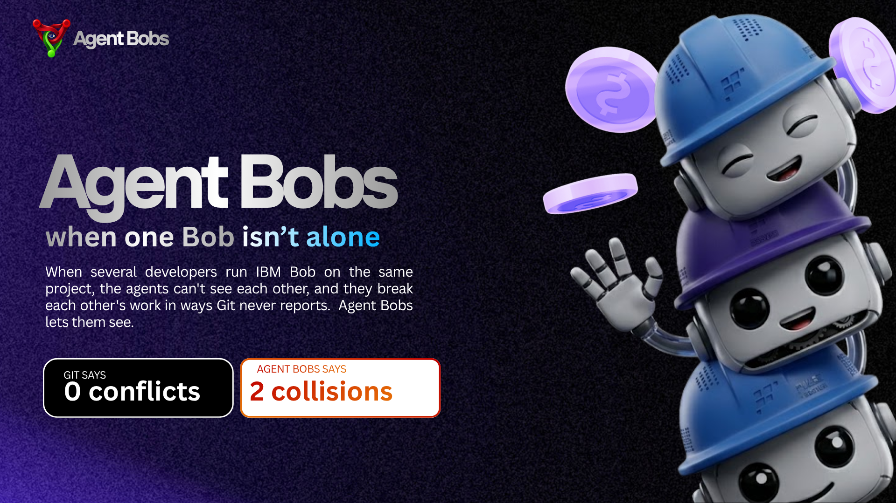
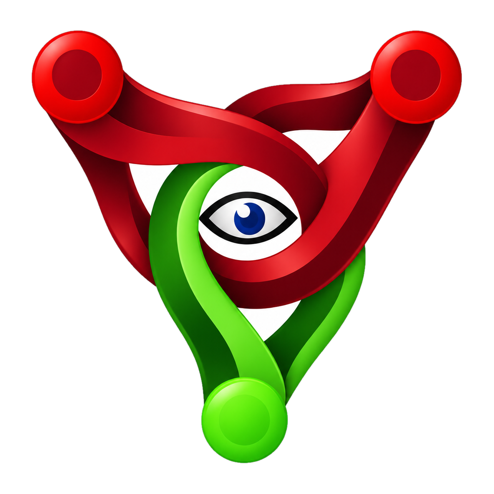
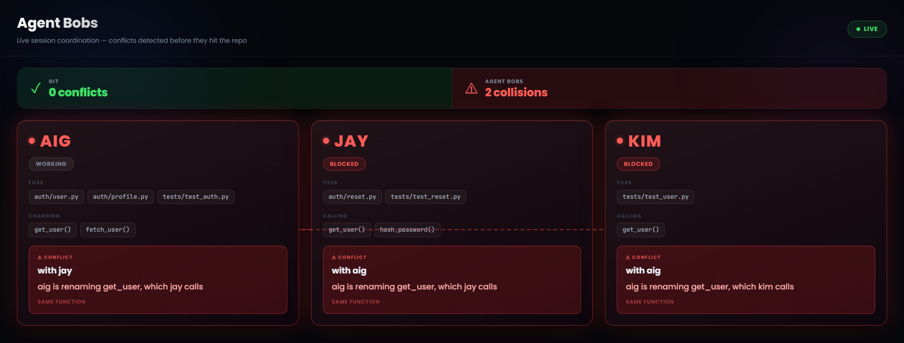
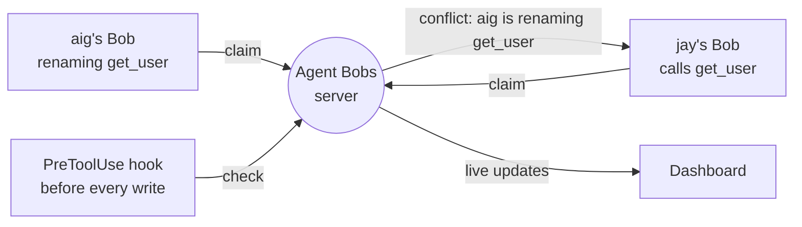

#  Agent Bobs

Built with IBM Bob, for IBM Bob, by team **iMAGIC** for the IBM Bob 2.0 Hackathon.



*A real capture from our live run. aig's Bob is renaming `get_user`; jay's and
kim's Bobs, about to write code that calls it, were stopped before writing a
line — while Git sees nothing wrong.*

## The problem

Three developers, three Bobs in Agent mode, one repository. aig's Bob renames
`get_user` to `fetch_user`. At the same time, jay's Bob adds password reset and
kim's Bob adds tests — both calling `get_user`. Every Bob does its job correctly
and passes its own tests.

Then the work is merged. The rename and the new callers sit in different files,
so **Git reports zero conflicts — and the code is broken.**

Bob already coordinates agents *inside* one developer's session: its subagents
report back to one conversation. This problem lives *between* sessions — separate
developers, separate copies of the code — where no single session can see.

## What we measured

The same three tasks, run by three real Bobs: first without Agent Bobs, then with
it. Full details in [`docs/RESULTS.md`](docs/RESULTS.md).

| | Without Agent Bobs | With Agent Bobs |
|---|---|---|
| What jay's and kim's Bobs did | wrote 84 lines calling a function that no longer existed | were stopped before writing a line |
| When the problem surfaced | at merge, when the tests failed | the moment each Bob declared its plan |
| What Git reported | 0 conflicts | 0 conflicts |
| Tests after the merge | **FAILED** (2 errors) | **OK** |

All three Bobs finished their tasks within about 40 seconds. Agents move too fast
for anyone to watch, which is why Agent Bobs acts on a collision instead of only
displaying it.

## How it works — inside Bob

Agent Bobs is built from Bob's own extension points:

- **A custom Bob mode, "Agent Bobs."** Before writing code, Bob declares its plan
  through the `claim` MCP tool: the files it will edit, the functions it will
  change and the functions it will call. If the plan collides with another Bob's,
  it stops and tells its developer who holds what, and why.
- **An MCP server** ([`server/`](server/)). One small Python process that every
  Bob connects to over streamable HTTP. It compares each plan with every other
  Bob's: two Bobs editing the same file collide; one Bob changing a function that
  another changes or calls collides; two Bobs that only call the same function
  don't.
- **Bob lifecycle hooks.** `SessionStart` gives each Bob its session name.
  `PreToolUse` checks every file write with the server and blocks it if another
  Bob holds the file — enforcement that works even if an agent forgets to ask.
- **`AGENTS.md` and the mode's rules**, which Bob loads automatically, carry the
  protocol.
- **A live dashboard** ([`dashboard/`](dashboard/)) showing every Bob's plan and
  every collision.

A claim lasts until the work is merged: until then, every other Bob's copy still
has the old code.



## How we built it with Bob

We built Agent Bobs with Bob. The server, the hooks and custom mode, the
dashboard, the demo app and the test harness were all developed in Bob tasks, in
Plan and Agent modes, from a shared `AGENTS.md` that all four of our Bobs loaded
automatically. Every change was reviewed and tested before merging; when a
review, a test or a live run found a problem, a follow-up Bob task fixed it. Our
two live runs are Bob tasks too — Bob sessions running inside the product itself.
The task summaries from all four team members are in
[`bob_sessions/`](bob_sessions/).

Running the product with real Bobs taught us things no document did. Bob's `Stop`
event fires on every pause, so releasing claims on it undid the protection. Bob's
real hook events name their fields differently from its documentation. And a
first live run caught nothing, because claims were released as soon as each Bob
finished — before its work was merged. All three are recorded in
[`docs/DECISIONS.md`](docs/DECISIONS.md) and [`docs/RESULTS.md`](docs/RESULTS.md).

## What we say openly

- The demo runs three Bob sessions on one laptop. The server speaks streamable
  HTTP, which works across machines, but we haven't demonstrated that.
- Function-level detection relies on each Bob declaring its plan. The hook
  guarantees file-level protection even when it doesn't.
- Claims last until the work is merged. Today they're released by hand, or by
  restarting the server.
- Coordination tools exist for other coding assistants. What we add is doing it
  inside Bob, with Bob's own modes, hooks and MCP support — see the prior art in
  [`docs/PITCH.md`](docs/PITCH.md).

## Roadmap

- **Release on merge.** A git post-merge hook releases a session's claims
  automatically once its work lands.
- **Wait mode.** Instead of stopping, a blocked Bob queues and continues once the
  work it depends on is merged.
- **Catch undeclared calls.** The hook reads the code a Bob is about to write and
  flags calls to a function another Bob is changing.
- **Other coding agents.** The server speaks MCP, so other agents could connect
  to it.

## Documentation

- [`AGENTS.md`](AGENTS.md) — the protocol and the rules we built by. Bob loads it
  automatically.
- [`docs/RESULTS.md`](docs/RESULTS.md) — measured results
- [`docs/DECISIONS.md`](docs/DECISIONS.md) — design decisions, and what changed
  after testing
- [`docs/PITCH.md`](docs/PITCH.md) — the pitch and the prior art
- [`docs/ROLES.md`](docs/ROLES.md) — who built what
- [`docs/SUBMISSION.md`](docs/SUBMISSION.md) — the hackathon requirements

## Repo layout

| Folder | What | Owner |
|---|---|---|
| `server/` | the server: collision rules, MCP tools, hook endpoints, websocket | Marco |
| `dashboard/` | the live dashboard | Gabriel |
| `demo/` | the sample app we break on purpose | Abrahm |
| `demo/.bob/` | the Agent Bobs mode, MCP connection and hooks | Alfonso |
| `harness/` | builds the three demo copies, merges their work, runs the tests | Marco |
| `bob_sessions/` | every team member's Bob task summaries | everyone |
| `docs/` | results, decisions, pitch, roles | — |

## Run the server

### Linux

One-time setup from the repo root:

    python3 -m venv .venv
    .venv/bin/pip install -r server/requirements.txt

Start the server (keeps running until Ctrl+C):

    .venv/bin/python -m server.main

### Windows

One-time setup:

    py -m venv .venv
    .venv\Scripts\pip install -r server\requirements.txt

Start the server:

    .venv\Scripts\python -m server.main

---

The server listens on `http://127.0.0.1:8765`, on your machine only. Bob
connects to `/mcp`, hooks post to `/api/claim`, `/api/check`, and `/api/release`,
and the dashboard connects to `ws://127.0.0.1:8765/ws`.

## See it work without Bob

Start the server and open `dashboard/index.html` in a browser. Then, in
PowerShell, play three Bobs:

```powershell
$api = "http://127.0.0.1:8765/api"
Invoke-RestMethod -Method Post "$api/claim" -ContentType application/json -Body '{"session":"aig","files":["auth/user.py"],"symbols":["get_user"]}'
Invoke-RestMethod -Method Post "$api/claim" -ContentType application/json -Body '{"session":"jay","files":["auth/reset.py"],"calls":["get_user"]}'
Invoke-RestMethod -Method Post "$api/claim" -ContentType application/json -Body '{"session":"kim","files":["tests/test_user.py"],"calls":["get_user"]}'
```

aig is renaming `get_user` while jay and kim both call it. The first claim comes
back clear, the other two come back as conflicts, and the dashboard turns red.
When aig finishes, jay and kim go back to green:

```powershell
Invoke-RestMethod -Method Post "$api/release" -ContentType application/json -Body '{"session":"aig"}'
```

Restart the server for a clean slate.

## Run the demo

The harness builds the three-session workspace, applies the demo edits, merges,
and runs the tests — all from the repo root.

**One-time setup** (no extra packages needed — stdlib only):

    py harness\setup_demo.py

This creates `%USERPROFILE%\agent-bobs-demo` with a `base/` git repo and three
clones (`demo-aig`, `demo-jay`, `demo-kim`), each pre-loaded with `.bob/`.

**Control run** (no Agent Bobs — shows the raw git + test failure):

    py harness\setup_demo.py --without-agent-bobs --fresh

**Open each session** in its own Bob window using the *Agent Bobs* mode:

    %USERPROFILE%\agent-bobs-demo\demo-aig
    %USERPROFILE%\agent-bobs-demo\demo-jay
    %USERPROFILE%\agent-bobs-demo\demo-kim

**After all three Bobs finish**, merge and run tests:

    py harness\merge_demo.py

This commits each session's work, merges them, runs `python -m unittest`, and
prints the `file:///…/dashboard/index.html?git=<N>` link.

**Run the harness self-test** (no Bob needed — exercises setup + merge end-to-end):

    py harness\test_harness.py

Exits 0 on success, non-zero on any failure.

## Run the tests

**Linux:**

    .venv/bin/python -m pytest server/test_core.py server/test_server.py -v

or without pytest:

    .venv/bin/python server/test_core.py
    .venv/bin/python server/test_server.py

**Windows:**

    .venv\Scripts\python -m server.test_core
    .venv\Scripts\python -m server.test_server

`test_core` checks the collision rules and needs no installs. `test_server`
starts a real server on port 8799 and checks that MCP clients, the hook API and
the websocket all share one state.

## Appendix: testing the hooks by hand (in-repo and out-of-repo files)

This demo runs two Bob sessions from two separate workspace folders and shows
the server catching a collision — one session claiming a file the other already
holds.

### 1. Start the server

From the repo root (keep this terminal open):

    .venv/bin/python -m server.main

### 2. Create two demo workspaces

Copy the `demo/` folder to two locations **outside** the repo. The folder name
after `demo-` becomes the session name:

    cp -r demo ~/demo-alf
    cp -r demo ~/demo-alf2

Your home directory is fine. The two folders must not be inside the repo root,
because Bob's `PreToolUse` hook derives the session name from the workspace
folder name.

### 3. Open each workspace in its own Bob window

In Bob, open `~/demo-alf` as a workspace. Repeat for `~/demo-alf2`. Select the
**Agent Bobs** mode in both windows.

Verify in each window:

- **MCP tab** → `agent-bobs` connected with 3 tools (`claim`, `check`, `release`).
- **Hooks tab** → 2 hooks registered (PreToolUse, SessionStart).
- Ask Bob: `"What is your Agent Bobs session name?"` — it should answer `alf`
  (or `alf2` in the second window).

### 4. In-repo file claim (same file, two sessions)

In **demo-alf**, ask Bob:

> "Claim `auth/user.py`, then ask me what to write before you edit it."

Do **not** answer the follow-up question yet. The claim stays active while Bob
waits: there is deliberately no `Stop` hook, because Bob's Stop event fires on
every pause and would release the claim.

In **demo-alf2**, ask Bob:

> "Add a comment to `auth/user.py`."

Expected result: Bob in demo-alf2 is **blocked**. It calls `check`, then tells
you:

> "`auth/user.py` is held by session 'alf'. Reason: …"

The dashboard (`dashboard/index.html`, open in a browser) should show demo-alf2's column in red.

### 5. Out-of-repo file claim (file outside the workspace folder)

Out-of-repo means a file whose path, when made relative to the workspace root,
starts with `../` — for example, a shared config file that lives next to both
demo folders.

Create a shared file:

    echo "# shared config" > ~/shared_config.py

In **demo-alf**, ask Bob:

> "Claim `../shared_config.py` and ask me what to write before you edit it."

In **demo-alf2**, ask Bob:

> "Edit `../shared_config.py`."

The hook normalises the path to `../shared_config.py` in both cases. The server
sees the same normalised string from both sessions and detects a `same_file`
collision. demo-alf2 is blocked for the same reason as in the in-repo case.

### 6. Verify the log

Each hook call appends one line to `.bob/hooks/hooklog.jsonl` in the workspace.
Open it in either demo folder:

    cat ~/demo-alf/.bob/hooks/hooklog.jsonl | python3 -m json.tool --no-indent

You should see:

- One line per tool call, with the tool's name, `_ts` and `_session`.
- Only file-writing tools (`write_file`, `apply_diff`, and so on) are claimed;
  reads and listings (`read_file`, `list_files`) are logged but never claimed.
